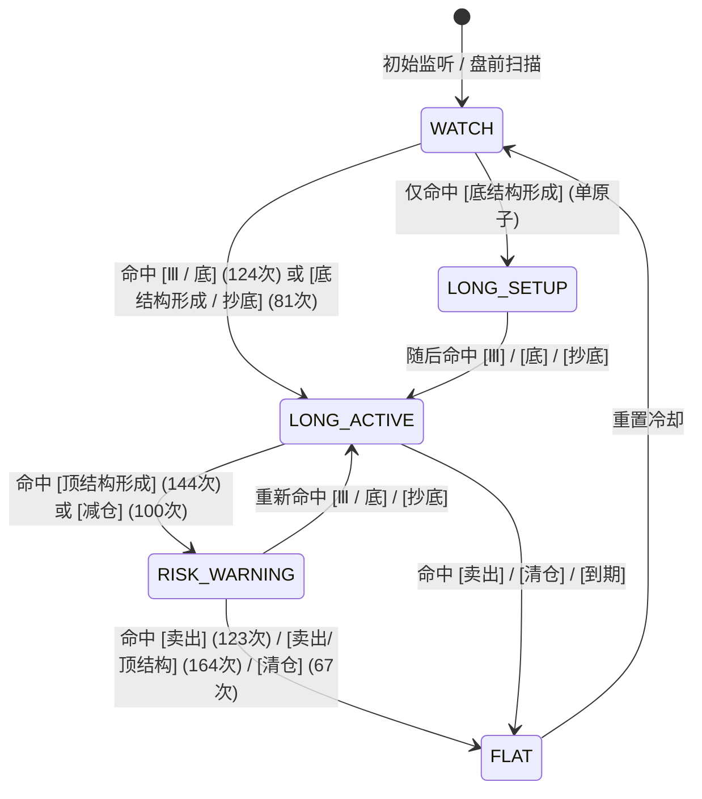

# 🔄 Stage 2: 信号原子共现与状态机规范 (V1.1 真实共现版)

> **版本标识**：`STAGE2-STATEMACHINE-V1.1-STRICT`  
> **数据基准**：严格基于 1,447 条教材中 840 条日内信号与 74 条选股样本的真实原子共现频次表构建。  
> **去伪存真**：删除洗盘（0次）、背离（0次）、第3浪（0次）、减半（0次）；补齐 `Ⅲ / 底` 主多头路径与高频空头原子；组合标签使用 `LONG_HINT / RISK_HINT / EXIT_HINT`，绝不混淆为可下单交易指令。

---

## 一、真实单原子出现总频次表 (840 + 74 样本全集)

| 原子名称 | 真实出现频次 | 归属方向提示 | 说明 |
| :--- | :---: | :---: | :--- |
| **顶结构形成** | **315 次** | `RISK_HINT` | 分时顶部背离预警 |
| **卖出** | **304 次** | `EXIT_HINT` | 触及阻力或形态破坏离场 |
| **底** | **178 次** | `LONG_HINT` | 筑底完成标记 |
| **Ⅲ** | **168 次** | `LONG_HINT` | 结构推进形态原子 |
| **抄底** | **126 次** | `LONG_HINT` | 急跌触及支撑提示 |
| **减仓** | **100 次** | `RISK_HINT` | 降低仓位暴露提示 |
| **底结构形成** | **95 次** | `LONG_HINT` | 底部形态构建 |
| **清仓** | **83 次** | `EXIT_HINT` | 无条件了结/离场 |
| **追** | **7 次** (选股附录) | `LONG_HINT` | 突破跟进提示 |

---

## 二、真实共现组合频次表 (Top Combos)

| 真实命中信号组合 | 样本出现次数 | 语义标签 | 业务含义 |
| :--- | :---: | :---: | :--- |
| **`卖出 / 顶结构形成`** | **164 次** | `EXIT_HINT` | 阻力位遇阻与顶结构共振 |
| **`顶结构形成`** | **144 次** | `RISK_HINT` | 单一顶结构预警，防守信号 |
| **`Ⅲ / 底`** | **124 次** | `LONG_HINT` | **最核心高频主多头组合** |
| **`卖出`** | **123 次** | `EXIT_HINT` | 单一卖出指令提示 |
| **`减仓`** | **100 次** | `RISK_HINT` | 单一减仓提示 |
| **`底结构形成 / 抄底`** | **81 次** | `LONG_HINT` | 底部结构与抄底共振 |
| **`清仓`** | **67 次** | `EXIT_HINT` | 单一清仓指令提示 |
| **`底、Ⅲ、抄底`** | **16 次** | `LONG_HINT` | 选股三共振强多头 |
| **`卖出 / 清仓 / 顶结构形成`** | **5 次** | `EXIT_HINT` | 极端破位三重出场共振 |

---

## 三、真实状态机转移图 (FSM)

### 核心流转规则：
1. **主多头入口**：以 `Ⅲ / 底`（124次）和 `底结构形成 / 抄底`（81次）为两大直接进入 `LONG_ACTIVE` 的主路径；
2. **防守过渡态**：以 `顶结构形成`（144次）与 `减仓`（100次）进入 `RISK_WARNING`；
3. **离场终态**：以 `卖出 / 顶结构形成`（164次）、`卖出`（123次）、`清仓`（67次）直接退出到 `FLAT`；
4. **隔离说明**：本状态机为群友纯技术原子状态机，与大V L2b 战法融合在后续单独的 Fusion 规范中定义，绝不在此混入伪规则。
