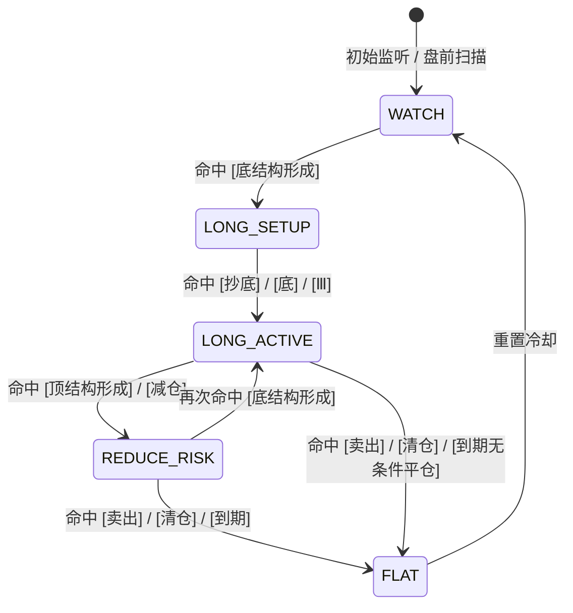

# 🔄 Stage 2: 信号原子共现与状态机规范 (STAGE2 Signal State Machine)

> **版本标识**：`STAGE2-STATEMACHINE-V1`  
> **数据基准**：严格基于已落盘的 1,447 条教材（「日内波段信号检测」999 条 +「每日选股」74 条）全量真实原子统计。  
> **设计原则**：只认客观存在的信号原子与共现组合，禁止臆造转移规则。

---

## 一、核心信号原子注册表 (Signal Atoms)

### 1. 买方多头原子集合 (Long / Entry Atoms)
- `底结构形成`：分时级别出现技术指标/价量底背离结构；
- `抄底`：盘口急跌后触及关键支撑的左侧提示；
- `底`：多周期共振筑底完成标签；
- `Ⅲ`：浪型识别标记（第 3 浪推动起步）。

### 2. 卖方空头/减仓原子集合 (Short / Exit Atoms)
- `顶结构形成`：分时级别出现技术指标/价量顶背离结构；
- `卖出`：触及阻力或形态破位出的出场信号；
- `减仓`：分批止盈/降低风险暴露提示；
- `清仓`：无条件止损/全部了结信号。

---

## 二、真实原子共现组合矩阵 (Observed Co-occurrence Matrix)

从 1,447 条教材样本中统计，信号绝大多数以“多原子共振”形式发出：

| 信号组合 (命中信号组合) | 归属方向 | 样本频率特征 | 业务含义 |
| :--- | :---: | :--- | :--- |
| `抄底 / 洗盘` | **BUY** | 高频 | 急跌洗盘后左侧低吸 |
| `抄底 / 底结构形成` | **BUY** | 高频 | 盘口支撑与背离结构共振 |
| `底结构形成 / 抄底 / 底 / Ⅲ` | **BUY** | 选股高频 | 日线级别强力多头共振 |
| `卖出 / 顶结构形成` | **SELL** | 高频 | 阻力位遇阻与顶背离共振 |
| `顶结构形成` | **WARN** | 高频 | 单一顶背离预警，提示减仓 |
| `清仓 / 顶结构形成` | **EXIT** | 极端行情 | 破位强平/到期清仓 |

---

## 三、信号状态机转移图 (Finite State Machine)

### 状态转移说明：
1. **WATCH (空仓观望)**：系统默认初始状态，等待盘前扫描或日内结构触发；
2. **LONG_SETUP (多头准备)**：出现 `底结构形成`，进入观察池；
3. **LONG_ACTIVE (多头激活)**：共振出现 `抄底` 或 `Ⅲ`，发出买方播报；
4. **REDUCE_RISK (防守减仓)**：持仓中若出现 `顶结构形成` 或 `减仓`，发出减半/收紧止损提示；
5. **FLAT (平仓离场)**：出现 `卖出`、`清仓` 或触发 **到期时间**，执行无条件平仓，返回 WATCH。

---

## 四、与大V L2b 战法的融合过滤规则

> **铁律**：群友状态机只负责产生“技术结构事件”，必须经过大V的 L2b 纪律进行双重闸门过滤！

1. **时段过滤**：若处于大V强调的“被动减/周五尾盘踩踏时段”，所有 `LONG_ACTIVE` 降级为 `WATCH`（不追左侧接刀）；
2. **共鸣加权**：若群友状态机处于 `LONG_ACTIVE`，且同窗大V在广播频道喊单同向标的，信号等级升级为 **高置信度 (High Conviction)**；
3. **风控硬拦截**：到期无条件平仓，禁止任何理由的逆势扛单。
