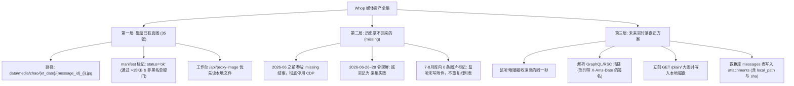

# Whop 媒体归档与实时落盘技术规范 (三层架构定论)

**文档版本**: v1.0.0  
**生效日期**: 2026-08-30  
**所属工程**: `whop-wechat-bridge`  

---

## 1. 核心架构认知：付费社群私有附件机制

Whop 社群内部的聊天与发布附件采用**双层安全防盗链架构**：
1. **AWS S3 私有桶预签名** (`X-Amz-Expires=86400`)：URL 签名仅 24 小时有效，过期直接返回 `HTTP 403 Forbidden AccessDenied`，Web 会话 Cookie 无法直穿私有桶；
2. **`img-v2-prod` 图片网关** (imgproxy + HMAC)：对过期的 S3 签名或 `preset:s128_square` 仅返回 11,750 字节的骨架屏或 2KB 头像；
3. **老帖归档特性**：2026-06 之前的历史老帖在前端页面渲染时，GraphQL 后端不再下发新的 `X-Amz-Signature`，导致历史过期链接永久无法再生。

---

## 2. 媒体资产三层治理体系



### 第一层：已经在盘上的真实图片（35 份 `ok`）
- **存储路径固定**：
  ```text
  data/media/zhao/{et_date}/{message_id}_{i}.jpg
  data/media/zhao/media_manifest.json
  ```
- **manifest 元数据标准**：
  ```json
  {
    "message_id": "post_1CXYCpXPkLs5VVnU5aBkJe",
    "cu_id": "CU_20260127_01",
    "channel_id": "chat_feed_1CU95KbtifP1JtuqTiVXZb",
    "et_date": "2026-01-27",
    "status": "ok",
    "sha256": "439b1a591e...",
    "bytes": 73871,
    "width": 1611,
    "height": 1440,
    "raw_url": "https://img-v2-prod.whop.com/...",
    "local_path": "data/media/zhao/2026-01-27/post_1CXYCpXPkLs5VVnU5aBkJe_0.jpg"
  }
  ```
- **硬门规则**：`bytes > 15KB` 且 SHA256 排除黑名单前缀（`0804573d`, `5f4dd331`）。

### 第二层：历史再也拿不回来的（`missing` 结案）
- 2026-06 之前的发布区与记录区老帖：因 GraphQL 不再签发、裸桶 403、缺少持久化 `file_id`，正式以 `missing` 结案；
- 彻底停止任何无意义的 CDP 页面爬取与并发扫帖；
- 6-26～28 的 29 条 11750 字节骨架屏：在技术文档中诚实定性为“采集失败（骨架占位）”，绝不写成“附件不存在”。

### 第三层：以后进库必须当场留下的标准正方案（行业标准范式）
- **核心原则**：**进库即落盘，绝不等夜跑，绝不存预签名链接到第二天**（对标 Discord / Slack 机器人与 Glassix 最佳实践）；
- **实时流程**：
  1. 监听或增量接收到赵哥消息的当刻，解析 `attachments`（获取活的 S3 预签名 URL）；
  2. **在同一秒内**发起 HTTP GET 请求下载原图字节流；
  3. 经过硬门校验（>15KB 且非骨架屏）后写入 `data/media/zhao/{et_date}/`；
  4. 将 `local_path`、`sha256`、`bytes` 同步写入 SQLite 的 `messages.attachments` 字段；
  5. 失败则记录 `status: missing`，正文保存原始链接但不假设后续能重新换签。

---

## 3. 金标、L2a 与战法注册表关系

1. **图侧 proposed**：只有拥有真实 `local_path` 的 CU 单元才能做图侧 `proposed` / 人工验图；
2. **纯文本金标**：无图消息照常提取 L2b 文本金标（如 G4/G5 `gold_text`，G6/G7 `proposed`，G1~G3 `unlocated`）；
3. **隔离铁律**：行情图只用于战法形态标注（`do_not_use_as_order: true`），**绝对不产生 L2a 自动化买卖单**；
4. **状态锁定**：`537 窗` 与 `known_kids_registry.json` 继续保持挂起与零写入。

---

## 4. 周一实盘真实验收清单 (10 行 Checklist)

1. [ ] **环境就绪**：确认 VM/服务器上 `monitor.js` 守护进程处于正常活跃运行状态。
2. [ ] **凭据检查**：确认机器本地 `.env` 包含最新 `WHOP_COOKIE`，且确认未提交至 Git。
3. [ ] **事件触发**：等待开盘后赵哥群内发出第一张带图行情消息（GraphQL/RSC 实时推送）。
4. [ ] **核验项 1 (磁盘)**：检查 `data/media/zhao/{et_date}/` 下是否当秒多出一个 `>15KB` 的全新 `.jpg` 原图。
5. [ ] **核验项 2 (清单)**：检查 `data/media/zhao/media_manifest.json` 是否当秒追加一行 `status: "ok"` 记录。
6. [ ] **核验项 3 (数据库)**：查询 SQLite `messages` 表，确认该消息记录的 `attachments` 列包含有效 `local_path` 与 `sha256`。
7. [ ] **工作台验证**：打开 Web 工作台对应消息，确认 `/api/proxy-image` 秒级渲染本地真图而非空白/过期图。
8. [ ] **硬门拦截检查**：若赵哥发的是骨架/头像，确认系统记录为 `placeholder_blocked` 且不污染 `ok` 清单。
9. [ ] **故障排查纪律**：若任一项缺失，仅排查 `monitor.js` 监听与网络，**严禁另开 CDP 重新爬取**。
10. [ ] **落盘收工**：首张图三项核验均通过即宣告进库落盘正方案正式实盘闭环！
