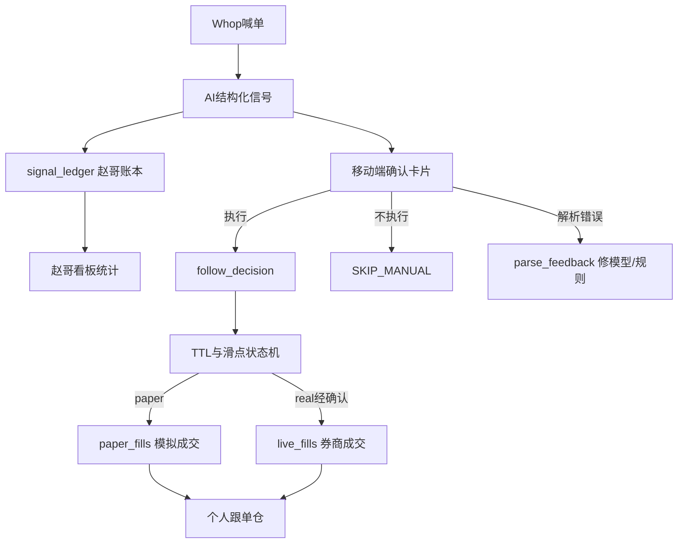

# L1 跟单：信号 / 确认 / 模拟仓 对齐方案

> 状态：`accepted`（2026-09-14）· Q-005 已决企微业务卡片 · **Phase A = REQ-027 Done（Gemini · `9d06fef`）· Phase B = REQ-028 Doing（Gemini）· cursor 队列 = REQ-003**  
> 依据：用户目标（模拟仓迭代 + 移动端确认 + 赵哥看板与个人跟单分仓）· 现网事实（[Explore L1 trade follow path](1acf7743-67e8-406e-aee7-aee21e6e9a70)）· 既有规格 [`data/specs/follow_execution_spec.md`](../../data/specs/follow_execution_spec.md)  
> 账本：`REQ-027`～`REQ-030` · `CHG-009`/`CHG-010` · 关联 `REQ-021` · 队列机制 `CHG-011`/`CHG-012`

---

## 1. 目标（一句话）

**解析正确 → 赵哥账本必记；是否跟单 → 仅你确认后进入个人账本；成交结果另记。**  
用本地模拟仓（先）跑通延迟/滑点/拒单，再用同一确认 UX 护住实盘。

---

## 2. 现状缺口（事实）

| 现状 | 问题 |
|------|------|
| `extractAndExecuteTrades` → `executeOrder` **无执行前 HITL** | 无法「执行 / 不执行 / 解析错误」 |
| `MOCK_TRADING_MODE` 默认沙盒 = **本机 SQLite**，非长桥模拟户 | 「模拟账户」短期应强化本地 paper，而非空想 broker paper |
| `/api/zhao-positions` 与跟单仓共用 `positions`/`orders` | 赵哥统计与个人跟单缠在一起 |
| `trade_review_pool` 是**事后**人审，不挡实时下单 | 不能当盘中确认门 |
| `follow_execution_spec.md` 已写 paper / 90s 卡片 / `follow_decisions` | **未接到** `extractAndExecuteTrades` |
| Local-Ops **禁** `place_order`（`REJ-003`） | 下单只留在 L1 `trading.js` / broker；不进 catalog |

---

## 3. 三账本（核心隔离）

| 账本 | 写入条件 | 谁看见 | 不做什么 |
|------|----------|--------|----------|
| **Signal（赵哥）** | 解析出明确 `{ticker, action, price, …}` 且未标 parse_error | 赵哥看板 / campaigns | **不**触发你的券商单 |
| **Decision（跟单意图）** | 你点「执行」或 paper 自动策略允许 | 跟单审计 | **不等于**成交 |
| **Fill（成交）** | 模拟撮合或券商回报 | 个人持仓/盈亏 | 失败/滑点拒单也要落原因码 |

原则：**解析对了，赵哥统计就对；你没点跟单，个人仓不动。**

---

## 4. 已拍板默认（对齐用；反对再改）

1. **先落地本地 Paper**（演进 `MOCK_TRADING_MODE` + `follow_decisions`），**不做**长桥模拟户首期（仓内无钩子）。  
2. **实盘禁止全自动**；仅确认卡片通过后走 `brokers/longbridge.js`。  
3. **移动端通道 = 企微业务推送 + 交互卡片/按钮回调**（**不是** `/ops`，**不是**运维 C2）。须独立 `CHG-009` 扩面，与 `wecom-freeze.md` 的 `/ops` 表并列「业务 HITL」专节。  
4. 卡片动作至少：`EXECUTE` / `SKIP` / `PARSE_ERROR`；默认 **90s 无操作 = SKIP**（对齐规格）。  
5. 滑点/TTL 状态机采用规格：`FIRE` / `SIZE_DOWN` / `SLIP_REJECT` / `EXPIRED` / `SKIP_NO_POS`。  
6. **catalog 永不出现 `place_order`**；告警不得触发跟单。

---

## 5. 分阶段交付

### Phase A — `REQ-027` 三账本 + 看板分源（P1）

- 落表：`trade_signals`（或规范化现有 review 池）+ `follow_decisions` + 区分 `account_type=paper|real` 的 fills。  
- `/api/zhao-positions` **只读 signal / 赵哥叙事**，不再把个人 `orders` 当赵哥持仓。  
- 个人 Tab 只读 decision+fill。  
- 热点：`database.js`、`server.js`、`public/app.js`、`monitor.js`（写信号处）。

### Phase B — `REQ-028` Paper 状态机（P1）

- 切断「解析后直接 `executeOrder` 实盘」；`MOCK≠false` 时走 paper 闸门。  
- 实现规格滑点带 + TTL；落 `decision_state`。  
- 用 paper 持仓做问题迭代（错码、延迟、拒单率）。  
- 热点：`trading.js`、`monitor.js`；**不动** catalog。

### Phase C — `REQ-029` + `CHG-009` 移动确认（P1）

- 出站：结构化卡片（代码/方向/喊单价/现价/滑点/TTL）。  
- 入站：userid 白名单回调 → 写 decision；`PARSE_ERROR` 回写信号质量，**不**记赵哥成交。  
- 更新 `wecom-freeze.md`：**新增「业务跟单 HITL」**，明确 ≠ `/ops` C0/C1/C2。  
- 单测 + 威胁说明（伪造点击、重放、越权 userid）。

### Phase D — `REQ-021` 验收门（P2，收口）

- 沙盒/实盘切换检查表；paper 合格指标（规格：方向准确率等）未达标 **禁止**开实盘确认通道。

---

## 6. 非目标（本方案不做）

- 企微开放运维 C2 / Agent 代确认跟单  
- Local-Ops catalog 下单  
- 首期长桥官方模拟账户 API  
- 用 NL Copilot 替代卡片确认  

---

## 7. 通道决策（Q-005）

**已决：企微业务推送 + 交互卡片/按钮回调。**  
理由：美股盘中以秒计，规格 TTL=90s；Dashboard 移动页依赖隧道+浏览器，易漏单。安全边界仍由 `CHG-009` 与 `/ops` 分立保证。

拍板后：03 中相关项已 `accepted`；05 认领后再改代码。`REQ-030`/`CHG-010`（推送文案实事求是）可与 Phase A 并行，热点 `monitor.js`。
