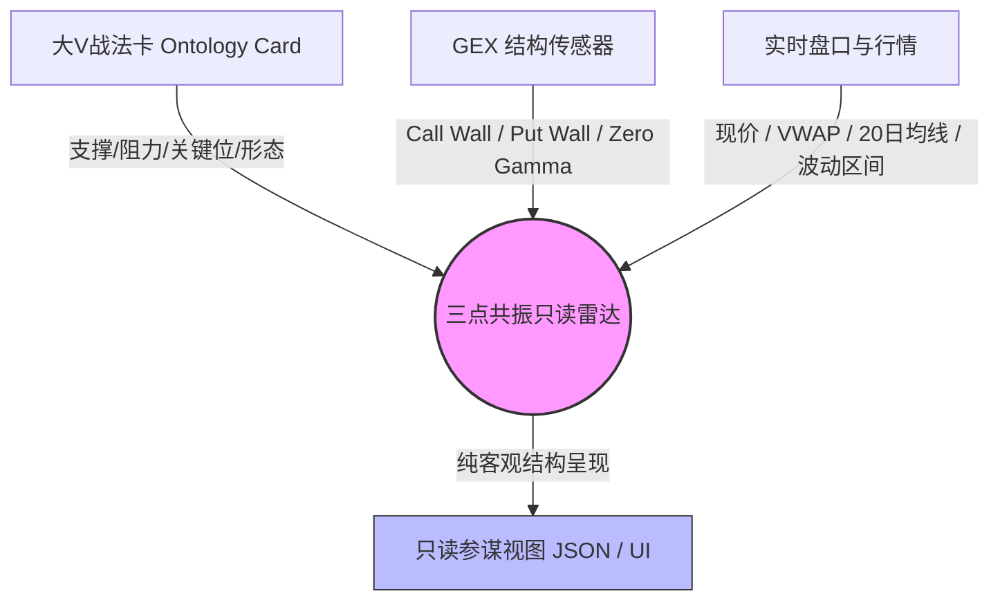

# REQ-038-T3 — 三点共振只读雷达设计稿（Resonance Radar Spec）

> 上级：[`03-requirements.md`](./03-requirements.md) REQ-038 · 归因口径 [`req038-t2-attribution-spec.md`](./req038-t2-attribution-spec.md) · 环境合同 [`environments.md`](./environments.md)  
> **单一真相源**：本设计稿为 Sprint 1 T3 权威规范。纯只读设计，绝不接入自动下单与 L2a actions。

---

## 1. 目标与安全红线（Non-Goals & Boundaries）

### 1.1 核心目标
将**大V知识库中经过验证的战法点位**、**GEX 市场做市商伽马结构墙**与**当前实时行情/盘口**进行三点空间对齐，以纯只读雷达（Read-only Radar）形式呈现「点位共振度」，辅助人类交易员进行盘前/盘中情境推演与风险防御。

### 1.2 核心安全红线（不可逾越）
1. **绝对资金隔离（REJ-003）**：雷达仅提供空间对齐数据与结构性事实，严禁输出任何形式的 `BUY` / `SELL` / `STRONG_BUY` 动作指令，严禁接入 `catalog.yaml` 中的执行流或券商下单接口。
2. **严禁接入 L2a 自动化（REJ-001 / REJ-008）**：雷达输出不可作为策略机（Strategy Engine）的自动触发器，不可绕过人工生成实盘信号。
3. **强制卡片 ID 溯源**：每一条共振推演必须严格绑定对应的 `card_id`（来自 `ontology_cards`）或图谱实体，确保所有大V观点皆有据可查、可复核。
4. **强制法律与合规免责声明**：所有雷达视图、API 与推送载荷必须附带强制免责声明，明确指出本内容仅为历史研报与衍生品结构之数学对齐，不构成投资建议。

---

## 2. 三点共振维度定义



### 维度 1：大V战法点位（Ontology Layer）
- **数据源**：`ontology_card`（只读句柄 `getDbReadOnly()`，SoR=`gcp-vm` 或本地镜像）
- **抽取要素**：
  - `card_id`（唯一标识，如 `card_1725...`）
  - `ticker`（标的代码，如 `TSLA`, `NVDA`, `QQQ`）
  - `support_resistance_json`：
    - `support`: 支撑点位数组（如 `[210.0, 215.5]`）
    - `resistance`: 阻力点位数组（如 `[230.0, 235.0]`）
  - `patterns`: 形态标签（已彻底脱敏，仅保留如 `["区间震荡", "箱体突破"]`）
  - `created_at`：观点发表时间戳（用于计算点位时效半衰期）

### 维度 2：GEX 伽马结构（Gamma Exposure Layer）
- **数据源**：`data/gex/latest.json`（由 GEX Sidecar 或 SCP 定时同步产生）
- **抽取要素**：
  - `call_wall`: 最大正伽马阻力墙（Call Open Interest / Gamma 最大集中点位）
  - `put_wall`: 最大负伽马支撑墙（Put Open Interest / Gamma 最大集中点位）
  - `zero_gamma`: 伽马翻转点（市场由多头做市顺势转向空头震荡的临界线）
  - `absolute_gamma`: 绝对伽马极值点
  - `gex_regime`: `positive_gamma`（均值回归/低波动）或 `negative_gamma`（趋势突破/高波动）

### 维度 3：实时盘口与价格行为（Tape / Price Action Layer）
- **数据源**：`services/kline.js` / Yahoo Finance / Futubull 行情接口
- **抽取要素**：
  - `current_price`: 最新成交价
  - `vwap`: 成交量加权平均价
  - `day_range`: 当日最高/最低价 `[low, high]`
  - `ma20` / `ma50`: 关键均线位置

---

## 3. 共振对齐判定算法（Resonance Logic）

共振是指**不同独立来源的关键价位在空间上高度重合**（重合容差阈值 $\delta$ 默认为 $\pm 1.2\%$ 或 标的日内 0.5 ATR）。

### 3.1 空间重合度分类
| 共振类型 | 触发条件 | 市场微观结构含义 |
|---------|---------|-----------------|
| **双重阻力共振 (Resonance Resistance)** | 大V阻力位与 GEX `call_wall` 差距 $\le \delta$ | 强技术位阻力叠加做市商抛压对冲墙，上行突破阻力极大 |
| **双重支撑共振 (Resonance Support)** | 大V支撑位与 GEX `put_wall` 差距 $\le \delta$ | 强技术位支撑叠加做市商接盘对冲墙，下行防守动能极强 |
| **临界翻转共振 (Regime Flip Alignment)** | 大V关键分水岭价位与 GEX `zero_gamma` 差距 $\le \delta$ | 波动率拐点与技术分界点重合，越过可能触发做市商由顺势买入转为加速做空 |
| **三重共振 (Tri-Resonance Focus)** | 上述共振点位同时紧邻现价（$|\text{Price} - \text{Level}| \le \delta$）或紧邻 VWAP | 盘口处于极其关键的博弈决战区域 |

### 3.2 共振置信度评分（Proximity Score）
$$S_{\text{resonance}} = \exp\left( - \frac{|P_{\text{card}} - P_{\text{gex}}|}{\sigma} \right) \times W_{\text{decay}}(t)$$
- $\sigma = \text{Price} \times 0.01$（1% 标尺）
- $W_{\text{decay}}(t) = 0.5^{\frac{\Delta t}{30\text{ days}}}$（大V观点随时间推移半衰衰减，超过 60 天的点位权重显著下调）
- 评分范围 $S \in [0.0, 1.0]$，仅当 $S \ge 0.65$ 时标记为有效共振事件。

### 3.3 双轨驱动模式与大V静默期判据（Dual-Track & Silence Fallback）

由于大V发言存在非连续性与事件驱动特征（可能数日静默），系统确立**双轨驱动**机制：

1. **大V活跃期（Confluence Mode · 双重验证）**：
   - 当大V当日或近期有明确图文点位时，计算大V点位与做市商 GEX 墙的空间重合度（±1.2%），点亮最高等级的三点共振。
2. **大V静默期（GEX Primary + Prior Rules · 客观底座）**：
   - 当大V未发言或未覆盖某标的时，**GEX 结构墙自动作为第一客观基准判据**（每日连续产生、数学确定性高）；
   - 自动继承大V经验同构的量化先验：
     - **SPX 60点箱体定律**：以 GEX Call Wall（天花板）到 Put Wall（地板）的 60 点区间作为日内/波段震荡边界；
     - **做市商对冲防线定律**：Put Wall 区域作为天然强支撑防御带，Call Wall 区域作为强阻力止盈带；
     - **时间窗口特性**：结合大V指出的「美东 15:00 期权强平回落，15:30~15:50 尾盘 V 反翘尾」做时空立体防守。

---

## 4. 纯只读数据结构契约（Output Schema）

```json
{
  "schema_version": "1.0.0",
  "generated_at": "2026-09-19T14:00:00.000Z",
  "disclaimer": "【纯客观结构参考 · 绝非投资建议】本雷达仅提供大V历史技术分析与期权做市商GEX结构之数学空间对齐，不包含任何买卖方向推荐，严禁作为自动交易依据。入市有风险，投资需谨慎。",
  "ticker": "TSLA",
  "current_price": 224.50,
  "gex_summary": {
    "regime": "positive_gamma",
    "call_wall": 230.00,
    "put_wall": 210.00,
    "zero_gamma": 218.50
  },
  "resonance_zones": [
    {
      "zone_type": "resistance_confluence",
      "price_center": 230.00,
      "price_span": [228.50, 230.50],
      "resonance_score": 0.88,
      "sources": {
        "gex": {
          "feature": "call_wall",
          "level": 230.00
        },
        "ontology_cards": [
          {
            "card_id": "card_1725450123_456",
            "level": 230.00,
            "role": "resistance",
            "card_created_at": "2026-09-04T15:30:00Z",
            "source_excerpt": "上方重要阻力位在230附近"
          }
        ]
      },
      "structural_observation": "大V阻力位 230.00 与期权最大 Call Wall (230.00) 发生完全空间共振，形成强结构性上方压力带。"
    }
  ],
  "safety_audit": {
    "has_buy_sell_signals": false,
    "is_l2a_eligible": false,
    "cards_referenced_count": 1
  }
}
```

---

## 5. 渲染与落地规范

1. **API 路由**：`GET /api/resonance-radar/:ticker`（仅挂载于本地运维 `:18789` 或只读查询网关，仅供人类查阅）。
2. **只读保护**：底层全部使用 `database.getDbReadOnly()`，防止查询对主库产生锁争用。
3. **降级与防呆**：
   - 若标的未在 GEX 监控名单中，返回 `gex_available: false`，仅呈现大V点位与盘口，不捏造共振；
   - 若未检索到有效的大V卡片，返回 `cards_available: false`，降级为常规 GEX 结构视图；
   - 严禁任何下游模块将 `structural_observation` 自动翻译为订单信号。
