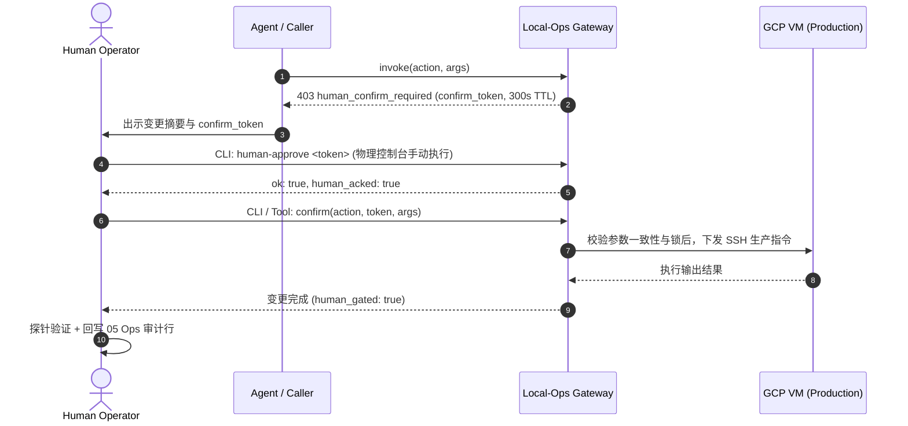

# Runbook：生产 C2 HITL 人工审批与执行规范（REQ-015）

> **责任与归属**：Owner: `agent:gemini` · 审阅基准：2026-09-14  
> **核心关联**：[`docs/project/05-wip-board.md`](../05-wip-board.md)（Ops 审计行）· [`runbooks/deploy-restart.md`](./deploy-restart.md)（重启判据）· 账本 [`03`](../03-requirements.md)（REQ-020）  
> **红线约束**：`REJ-001` · `REJ-002` · `REJ-007` · `REJ-009`

---

## 1. 范围与受控操作

生产 C2（高危、不可逆或直接影响生产运行）受到本地网关（Local-Ops Gateway）强类型门禁与双重人机闭环拦截。

### 受控生产 C2 能力面
- **`gcp.deploy_align`**：将生产 GCP 虚拟机的工作区 `git reset --hard` 到指定的 40 位 Git SHA（代码发布/对齐）。
- **`gcp.pm2_restart`**：生产 PM2 进程具名热重启（受限白名单：`whop-web-dashboard`、`whop-ingest-worker`、`whop-wechat-bridge`）。

### 绝对排除面
- **企微 `/ops`**：仅开放只读 C0 与 `gex.collect`，严禁承载任何 C2，亦不得输入或消耗 `confirm_token`（`REJ-001`）。
- **下单及交易**：系统中不存在任何 `place_order` 生产能力（`REJ-003`）。
- **自治链路**：监控告警、自动化看门狗或降级逻辑严禁串联生产 C2（`REJ-004` / `REJ-009`）。

---

## 2. 审批人资格与职责

- **执行资格**：仅限持有生产环境部署权限的 **人类运维人员 / 管理员（Human Operator）** 具有审批执行权。
- **禁止 Agent 代跑（`REJ-007`）**：
  - AI 编码助手、子 Agent、自动化任务脚本**绝对禁止**调用或代跑 `node tools/local-ops/cli.js human-approve <token>`。
  - Agent 不得在未获人类真实执行前，凭空假设或声称已完成 HITL 审批。
- **职责要求**：
  - 确认变更处于可接受的维护窗口（开盘活跃交易时段非紧急故障严禁重启核心 worker）。
  - 确认代码对齐的 SHA 已合入 `origin/main` 且测试通过。
  - 严格对照参数摘要，确认无越权或误操作目标。

---

## 3. 标准操作流程（SOP）

生产 C2 执行遵循标准 6 步闭环流程：
`Invoke (提议)` → `Review (审查)` → `Approve (签署)` → `Confirm (执行)` → `Verify (验证)` → `Audit (审计)`



### 步骤 1：发起变更提议（Invoke）
由 Operator 或辅助 Agent 通过 CLI 或 Local-Ops 工具提议调用：
```bash
node tools/local-ops/cli.js invoke gcp.pm2_restart '{"name":"whop-web-dashboard"}'
# 或代码对齐：
node tools/local-ops/cli.js invoke gcp.deploy_align '{"sha":"1352705b76b2c286e11894d8d1e39a341b590be4"}'
```
**网关返回示例**：
```json
{
  "ok": false,
  "denied": true,
  "code": "human_confirm_required",
  "id": "gcp.pm2_restart",
  "class": "C2",
  "message": "Production C2 requires human-approve then confirm_token.",
  "confirm_token": "u4Z...3-A",
  "expires_in_sec": 300,
  "expires_at": "2026-09-14T11:45:00.000Z",
  "requires_human": true,
  "human_acked": false,
  "summary": { ... }
}
```

### 步骤 2：出示与审查摘要（Review）
人类审批人可使用 `pending` 指令核对当前处于挂起状态的变更：
```bash
node tools/local-ops/cli.js pending
```
**审查核对项**：
- [ ] 动作 `id` 与参数 `args`（目标进程名、40 位 SHA）是否准确无误。
- [ ] 重启判据是否符合 [`runbooks/deploy-restart.md`](./deploy-restart.md)（无代码变更禁止无谓重启）。
- [ ] 确认 token 未过期（TTL 为 5 分钟 / 300 秒）。

### 步骤 3：人类终端签署审批（Human Approve）
由人类管理员在受信任宿主机的本地终端**手动执行**：
```bash
node tools/local-ops/cli.js human-approve <confirm_token>
```
**成功响应**：
```json
{
  "ok": true,
  "confirm_token": "u4Z...3-A",
  "id": "gcp.pm2_restart",
  "human_acked": true,
  "human_acked_at": "2026-09-14T11:42:15.123Z",
  "expires_at": "2026-09-14T11:45:00.000Z"
}
```

### 步骤 4：确认下发执行（Confirm）
在 token 5 分钟有效期内，传入与原始 invoke 完全一致的参数触发执行：
```bash
node tools/local-ops/cli.js confirm gcp.pm2_restart <confirm_token> '{"name":"whop-web-dashboard"}'
```
> **安全机制说明**：
> - 网关会严密比对 `sha256(id + 规范化args)`，若与创建时参数不符，立即拒绝（`token_args_mismatch`）。
> - 网关具备单并发互斥锁（`c2Busy`），杜绝并发冲突（`busy`）。
> - Token 为一次性凭据，消费后即刻物理销毁，杜绝重放攻击。

### 步骤 5：状态验证与冒烟测试（Verify）
根据执行的操作类型进行生产探针验证：
- **若是代码对齐 (`gcp.deploy_align`)**：
  ```bash
  node tools/local-ops/cli.js invoke gcp.git_head
  ```
  确认远端 HEAD SHA 与期望一致。
- **若是服务重启 (`gcp.pm2_restart`)**：
  ```bash
  node tools/local-ops/cli.js invoke gcp.health
  ```
  校验对应服务 `/health` 探针状态为 `ok: true`，且 HTTP 响应正常。

### 步骤 6：审计闭环回写（Audit Loop，REQ-020 对齐）
任何生产 C2 操作执行完毕后，执行人必须在 10 分钟内将变更记录更新至 [`docs/project/05-wip-board.md`](../05-wip-board.md) 的 **§3「Ops 审计行」**：

```markdown
| 2026-09-14 19:45 (UTC+8) | @human-operator | gcp.pm2_restart | whop-web-dashboard | ok | token:u4Z.. 修复只读UI展示 |
```
- **字段要求**：时间（含时区） · 操作人 handle · 动作名称 · 目标对象 · 执行结果（ok/failed） · 关联 token 摘要及原因说明。

---

## 4. 异常与失败分支处理

| 异常现象 | 根因 | 处理 SOP |
|----------|------|----------|
| `invalid_or_expired_token` | Token 超过 5 分钟有效窗口，或已被二次使用 | Token 已物理销毁。不得强行重试，须从步骤 1 重新 invoke 重新生成 Token。 |
| `human_approve_required` | 未经过步骤 3 即尝试调用 confirm | 必须由人类先执行 `human-approve`；若为恶意/异常调用，核查调用方身份。 |
| `token_args_mismatch` | confirm 传入的 JSON 参数与提议时的参数哪怕有微小改动 | 网关拒绝执行。检查传入参数，保持与提议时一致；若需要更改参数，必须重新 invoke。 |
| `busy` | 当前有另一项 C2 操作正在占用管道 | 稍候 15–30 秒，待前置 C2 释放互斥锁后再试。 |
| 人工审查决定放弃（Abort） | 发现参数有误、时机不妥或突发风险 | **无需任何销毁指令**。直接停止操作，Token 将在 5 分钟后自动静默过期作废。 |

---

## 5. 绝对禁止事项清单

1. **严禁 Agent 伪造 / 代行审批**：任何 Agent 工具链严禁集成自动化执行 `human-approve` 的代码逻辑。
2. **严禁企微触碰 C2**：严禁在企微 `/ops` 中增加审批、重启、对齐相关指令。
3. **严禁告警联动触发**：任何告警（Prometheus、Log Watcher）只能发送告警通知，绝对禁止自动触发 C2。
4. **严禁私自绕过 Local-Ops Gateway**：非紧急灾难下严禁使用未受控的私自 SSH 交互隧道直接在生产机器执行 pm2 变更。
