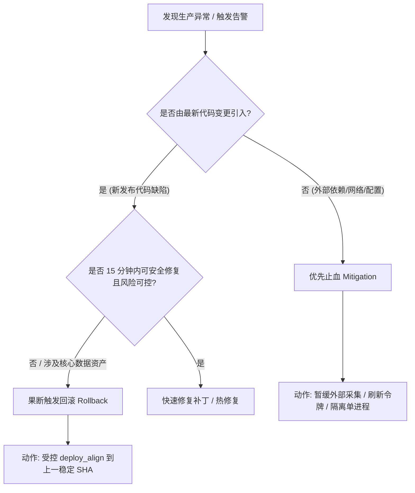

# Runbook：事故响应与回滚应急规范（REQ-016）

> **责任与归属**：Owner: `agent:gemini` · 审阅基准：2026-09-14  
> **核心关联**：[`runbooks/hitl-c2.md`](./hitl-c2.md)（C2 HITL SOP）· [`runbooks/deploy-restart.md`](./deploy-restart.md)（重启判据）· 看板 [`05`](../05-wip-board.md)  
> **红线约束**：`REJ-002` · `REJ-004` · `REJ-009` · **严禁临场通用 SSH 当流程**

---

## 1. 事故分级与宣布人

生产事故严禁私下静默处理，必须依据影响面快速定级并由明确责任人公开宣告：

| 级别 | 定义与典型场景 | 响应时限 | 宣布人 / 决策人 | 沟通渠道 |
|------|----------------|----------|-----------------|----------|
| **P0 (致命)** | 跟单引擎触发异常/错误订单、主 SQLite 数据库损坏/锁死、核心 Worker 持续崩溃重启导致业务全线阻断。 | **≤ 5 分钟** | **Human Operator / 管理员**（严禁 Agent 越权代发） | 生产应急群 + [`05 看板`](../05-wip-board.md) 标记 |
| **P1 (严重)** | 消息推送全量中断/严重积压（延迟 > 5m）、企业微信推送因 IP/Token 报错 60020、Whop Webhook 持续丢失、只读看板不可访问。 | **≤ 15 分钟** | **Human Operator** | 生产应急群通报 |
| **P2 (一般)** | 监控告警单次假阳性、GEX 盘前单次拉链超时（有兜底机制）、非关键静态前端样式或小展示 bug。 | 常规工单 | 开发/运维排查 | 登记于 [`04`](../04-leftovers-problems.md) 或次级任务 |

> **关键规则**：AI Agent 仅具有事故侦察与报告输出职责，**绝对禁止**擅自宣布或解除事故状态。

---

## 2. 止血（Mitigation）vs 回滚（Rollback）正向判据

面对生产异常，必须按照「止血优先于回滚、受控操作优先于盲目重启」原则决断：



### 止血（Mitigate）适用场景
- **现象**：上游 Futu OpenD 未就绪或企业微信通道短暂抖动；某单一依赖资源吃紧；配置参数漂移。
- **手段**：
  1. 暂停高开销的外部同步（如暂缓 GEX 盘中高频 collect）；
  2. 针对单个独立只读进程进行具名 HITL 重启（如只重启 `whop-web-dashboard`）；
  3. **不触碰 Git 版本与数据库 schema**。

### 回滚（Rollback）触发判据（满足其一即触发）
1. **发布后崩溃循环**：执行代码对齐或服务重启后，进程无法维持稳定状态，日志出现连续未捕获致命异常（Crash Loop）；
2. **核心业务逻辑污染**：Ingest 写入逻辑异常，导致消息错乱或数据库坏块；
3. **不可预见的跟单/风控偏差**：信号解析异常危及资金安全（绝对第一优先级触发）；
4. **无法在 15 分钟内快速定位并安全修复**的重大 P0/P1 问题。

---

## 3. 标准化逐步回滚流程（受控 Local-Ops 配方）

> **红线警示**：**严禁临场随手 SSH 上去运行未经审计的 `git checkout`、`pm2 kill` 或手动修改生产文件。**  
> 所有回滚步骤必须遵循受控配方与 [`runbooks/hitl-c2.md`](./hitl-c2.md) HITL 流程。

### 步骤 1：确认上一稳定 SHA
1. 查看 [`docs/project/05-wip-board.md`](../05-wip-board.md) 的 Ops 审计行或 Git 历史，确定回退的目标稳定版本（必须为 40 位小写十六进制 SHA，且必须已是 `origin/main` 的祖先 commit）。
2. 核对目标 SHA：
   ```bash
   git log -5 --oneline origin/main
   ```

### 步骤 2：发起代码回滚提议（Invoke `gcp.deploy_align`）
通过本地 CLI 提议将生产代码重置到稳定 SHA：
```bash
node tools/local-ops/cli.js invoke gcp.deploy_align '{"sha":"<TARGET_STABLE_SHA>"}'
```
- 网关返回 `human_confirm_required` 及 5 分钟有效期的 `confirm_token`。

### 步骤 3：人类审批与签署（Human Approve）
人类管理员在受信任终端手动执行审批：
```bash
node tools/local-ops/cli.js human-approve <confirm_token>
```

### 步骤 4：确认下发回滚（Confirm）
传入原参数确认执行回退：
```bash
node tools/local-ops/cli.js confirm gcp.deploy_align <confirm_token> '{"sha":"<TARGET_STABLE_SHA>"}'
```
- 远端将执行固化的安全脚本（`gcp_deploy_align.sh`），安全重置工作区（`git reset --hard <SHA>`），并明确不自动触发重启。

### 步骤 5：具名重启受影响进程（对齐 REQ-019 判据）
回滚代码若涉及业务逻辑，必须根据 [`runbooks/deploy-restart.md`](./deploy-restart.md) 重启对应服务：
```bash
# 1. 提议重启核心 worker
node tools/local-ops/cli.js invoke gcp.pm2_restart '{"name":"whop-ingest-worker"}'

# 2. 人类审批并确认
node tools/local-ops/cli.js human-approve <worker_token>
node tools/local-ops/cli.js confirm gcp.pm2_restart <worker_token> '{"name":"whop-ingest-worker"}'

# 3. 若涉及只读面板或共享依赖，同理具名重启 dashboard
node tools/local-ops/cli.js invoke gcp.pm2_restart '{"name":"whop-web-dashboard"}'
node tools/local-ops/cli.js human-approve <dash_token>
node tools/local-ops/cli.js confirm gcp.pm2_restart <dash_token> '{"name":"whop-web-dashboard"}'
```

---

## 4. 灾难级极端备用路径（Break-Glass Emergency）

仅当 Local-Ops 本地网关自身彻底不可用（例如本地机器崩溃或隧道断绝）且发生 P0 致命事故时的唯一破窗逃生路径：

1. **唯一允许的人工应急命令（按字面执行，严禁发散）**：
   ```bash
   ssh -o BatchMode=yes <PROD_HOST> "cd /home/wikitang628/whop-wechat-bridge && git fetch origin && git reset --hard <TARGET_STABLE_SHA> && pm2 restart whop-ingest-worker --update-env && pm2 restart whop-web-dashboard --update-env"
   ```
2. **事后补偿义务**：
   - 必须在 1 小时内向 [`05-wip-board.md`](../05-wip-board.md) 补充登记该破窗操作记录；
   - 必须在 24 小时内在 [`04`](../04-leftovers-problems.md) 提交事故根本原因分析（RCA）及改进措施。

---

## 5. 回滚后验证与验收清单（Verification Checklist）

回滚与重启完成后，按顺序进行验收：

- [ ] **版本校验**：执行 `node tools/local-ops/cli.js invoke gcp.git_head`，验证远端当前 SHA 与目标稳定 SHA 完全一致。
- [ ] **进程生命周期**：执行 `node tools/local-ops/cli.js invoke gcp.pm2_status`，确认各服务状态均为 `online`，且重启计数未持续递增。
- [ ] **服务健康检查**：执行 `node tools/local-ops/cli.js invoke gcp.health`，返回 `{"ok": true, "status": 200}`。
- [ ] **错误日志扫描**：执行 `node tools/local-ops/cli.js invoke gcp.logs '{"name":"whop-ingest-worker"}'`，确认无持续出现的致命 Traceback。
- [ ] **一致性冒烟**：执行 `node tools/local-ops/cli.js invoke gcp.smoke_consistency`，验证生产数据库与状态一致性。

---

## 6. 审计与闭环要求

1. **更新看板**：在 [`docs/project/05-wip-board.md`](../05-wip-board.md) §3「Ops 审计行」如实追加记录：
   ```markdown
   | 2026-09-14 20:00 (UTC+8) | @human-operator | rollback (deploy_align + restart) | whop-ingest-worker | ok | 回滚至 a1b2c3d，恢复推送通道 |
   ```
2. **技术复盘**：本次事故原因、回滚耗时及后续改进项记录在 [`docs/project/04-leftovers-problems.md`](../04-leftovers-problems.md) 或立项为新 `REQ`。
3. **红线复核**：确认无任何自动化 Agent 或脚本代跑 `human-approve`，确认所有 C2 均有清晰的人机审批记录。
