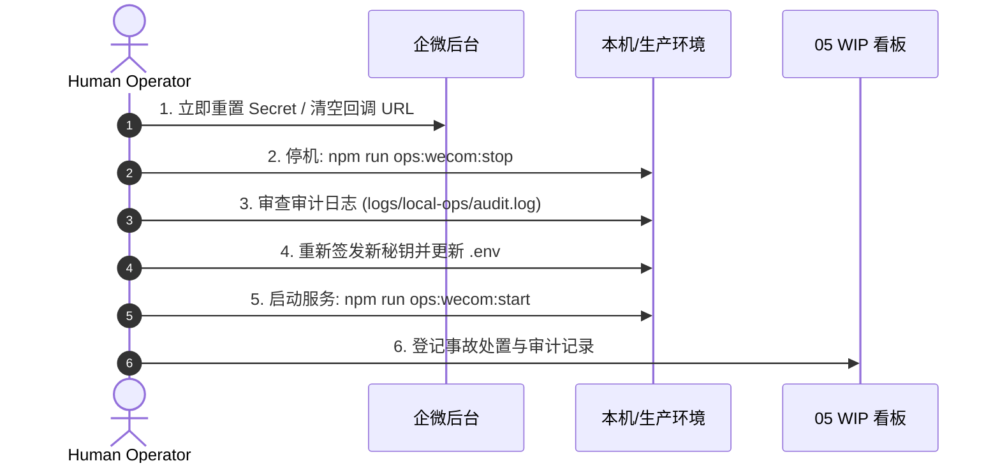

# Runbook：密钥轮换与企微运维变更控制（REQ-017）

> **责任与归属**：Owner: `agent:gemini` · 审阅基准：2026-09-14  
> **核心关联**：[`tools/local-ops/WECOM-SETUP.md`](../../../tools/local-ops/WECOM-SETUP.md) · [`docs/project/05-wip-board.md`](../05-wip-board.md) · [`runbooks/hitl-c2.md`](./hitl-c2.md)  
> **红线约束**：**严禁在 Git 提交、文档、代码与聊天记录中泄漏真实密钥明文**；`.env` 严禁提交。

---

## 1. 凭证清单与资产分布

企微运维体系（Local-Ops P4 / 手机 `/ops`）涉及以下核心凭证与网络资产：

| 资产 / 环境变量 | 作用与流向 | 敏感级别 | 存储位置 |
|-----------------|------------|----------|----------|
| `WECOM_OPS_CORP_ID` | 企业微信唯一企业标识（入站验签 + 出站鉴权） | 中 | 宿主机根目录 `.env` |
| `WECOM_OPS_USERIDS` | 允许在手机端发送 `/ops` 指令的操作者白名单 | 高 (权限边界) | 宿主机根目录 `.env` |
| `WECOM_OPS_TOKEN` | 企微入站回调消息签名校验凭据 | 高 | 宿主机根目录 `.env` + 企微后台 |
| `WECOM_OPS_ENCODING_AES_KEY` | 43位消息对称加密密钥（入站报文加解密） | 高 | 宿主机根目录 `.env` + 企微后台 |
| `WECOM_OPS_AGENT_ID` | 企微自建运维应用唯一 ID | 低 | 宿主机根目录 `.env` |
| `WECOM_OPS_SECRET` | 企微自建应用调用凭证（换取出站 `access_token`） | **极高 (核心)** | 宿主机根目录 `.env` |
| **GCP 固定出网 IP** | 生产宿主机出站 IP（如 `35.212.142.173`），防企微 60020 报错 | 中 (网络资产) | 企微后台「企业可信IP」配置 |
| **反向公网隧道** | Cloudflare Tunnel / SSH 反向暴露本机 `18789` 端口 | 中 | 运行态隧道进程 + 企微回调 URL |

---

## 2. 凭证安全轮换标准流程（SOP）

轮换原则：**平滑过渡、先配本地再切后台、双向校验**。

### 2.1 轮换 `WECOM_OPS_SECRET`（主动推送凭据）
当 Secret 到期、管理员变更或常规例行轮换时：
1. **企微后台重置**：
   - 登录 [企业微信管理后台](https://work.weixin.qq.com/wework_admin/frame) → 应用管理 → 进入运维自建应用；
   - 点击 Secret 后的「重置」，向管理员手机企微发送确认验证；
   - 获取新 Secret。
2. **本地配置更新**：
   - 编辑宿主机根目录 `.env`：
     ```ini
     WECOM_OPS_SECRET=<新生成的Secret>
     ```
3. **重启本地守护服务**：
   ```powershell
   npm run ops:wecom:restart
   # 或 npm run ops:http
   ```
4. **验证**：在手机企微端发送一次耗时命令（如 `/ops gex collect`），确认异步完成后能正常收到推送通知。

### 2.2 轮换 `WECOM_OPS_TOKEN` 与 `WECOM_OPS_ENCODING_AES_KEY`（入站回调验签）
> **注意**：企微后台保存新配置时，会立刻向回调 URL 发起带 `echostr` 的 GET 验签。本地服务必须先准备好新配置。

1. **生成新凭证**：
   - 在企业微信后台点击「随机获取」Token 与 EncodingAESKey（**先不要点保存**）。
2. **本地同步更新并重启**：
   - 将后台生成的两个字符串拷贝并更新到本地 `.env`：
     ```ini
     WECOM_OPS_TOKEN=<新Token>
     WECOM_OPS_ENCODING_AES_KEY=<新43位EncodingAESKey>
     ```
   - 立即重启本地服务：
     ```powershell
     npm run ops:wecom:restart
     ```
3. **后台保存并触发验签**：
   - 回到企微后台页面，点击「保存」。若提示保存成功，则证明握手验签通过。
4. **验证**：在手机企微发送 `/ops ping` 或 `/ops help`，收到即时回复即表示轮换完成。

### 2.3 `WECOM_OPS_USERIDS` 白名单管理（授权变更）
- **人员加入**：在通讯录获取该成员 `UserId`，追加至 `.env`（英文逗号分隔）：
  ```ini
  WECOM_OPS_USERIDS=Wikitang,Admin02
  ```
- **人员移出 / 离职**：立即从 `.env` 中移除对应 UserId，重启服务。
- **安全红线**：若 `WECOM_OPS_USERIDS` 为空，系统网关将执行熔断，默认拒绝所有手机指令。

---

## 3. GCP 出网固定 IP 变更（防 60020 报错）

### 3.1 背景与机制
由于企业微信出站推送 API 强制开启 IP 白名单，若直接使用家庭宽带动态公网 IP 推送，会因 IP 漂移导致 `60020: not allow to access from your ip` 错误。系统默认采用 `WECOM_OPS_PUSH_VIA=gcp`，经由生产 GCP 固定的静态公网出网。

### 3.2 IP 变更 SOP（双注册滚动法）
若生产 GCP VM 迁移、重搭或变更静态 IP：
1. **追加注册**：在企业微信后台「企业可信IP」白名单中，**先追加**新的公网 IP（保留旧 IP，避免闪断）。
2. **环境配置与冒烟**：更新本地 SSH 目标主机配置，发起单次推送测试。
3. **删除旧 IP**：确认新 IP 推送稳定连续 24 小时无 60020 报警后，从企微后台移除旧 IP。

---

## 4. 密钥泄露应急响应预案（P0 / 10 分钟应急）

一旦发现凭证被提交至公开代码库、日志泄露或被未授权第三方获取：



1. **第 1 分钟（切断入口）**：
   - 立即登录企业微信后台，点击 Secret「重置」，使已泄露的凭证立刻失效；
   - 清空或修改「接收消息」回调 URL 为非法地址，立刻掐断外部指令入站通道。
2. **第 3 分钟（本地熔断）**：
   - 在宿主机执行：
     ```powershell
     npm run ops:wecom:stop
     ```
3. **第 5 分钟（排查入侵与越权）**：
   - 检查 `logs/local-ops/audit.log` 及 PM2 日志，核对泄露窗口期内的指令调用记录；
   - 重点确认有无未授权的 `gex.collect` 刷量行为或提权攻击。
4. **第 8 分钟（重置与启动）**：
   - 重新生成全套 Token / EncodingAESKey / Secret，更新本地 `.env`；
   - 重启服务并恢复企微后台配置。
5. **闭环（登记与复盘）**：
   - 将泄露原因及处置步骤填入 [`docs/project/05-wip-board.md`](../05-wip-board.md) 的 Ops 审计行；
   - 在 [`docs/project/04-leftovers-problems.md`](../04-leftovers-problems.md) 中登记安全复盘记录。

---

## 5. 防泄露硬红线与日常合规要求

1. **禁止提交 `.env`**：任何提交前运行 `git status`，严格确认未跟踪或修改 `.env`。
2. **禁止文档明文**：所有 Markdown 方案、示例、测试断言中涉及密钥时，必须使用占位符（如 `<WECOM_OPS_SECRET>` 或 `corp_secret_***`）。
3. **日志脱敏**：本地网关与企微回调处理逻辑中，禁止 `console.log(process.env)`，入站签名参数与 Access Token 必须自动脱敏。