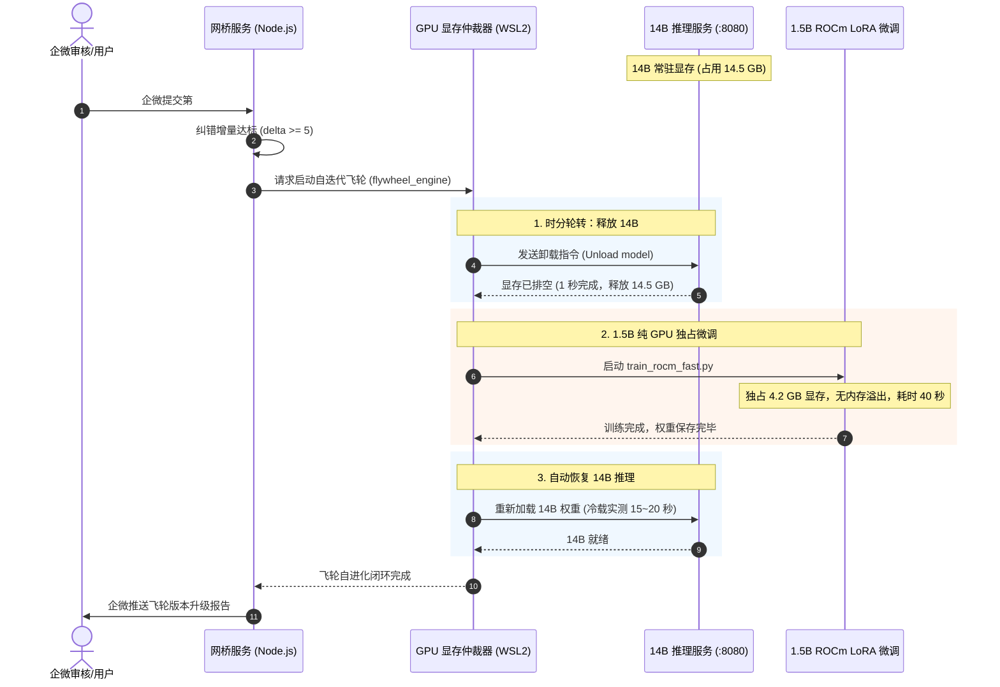

# 统一 WSL2 AI 运行时架构改造方案 (CHG-018 提案)

> **上级索引**：[`README.md`](./README.md) · 账本 [`03-requirements.md`](./03-requirements.md) (`CHG-018`) · 审阅 [`07-review-inbox.md`](./07-review-inbox.md)  
> **提案方**：`agent:gemini`  
> **审阅方**：`agent:cursor`（见 `05` §0.R-A 批次 `PKG-WSL-AI-RUNTIME`）  
> **当前状态**：`done` · **Q-007 Human 确认关 LMS 切流 OK**（2026-09-19）；可选残留 DEBT-014（Supervisor 绑真实二进制，P2）

---

## 1. 背景与痛点诊断

在 RX 7900 XT (20GB 显存) 单卡承载实盘 AI 系统的运行中，暴露出当前混合架构的核心矛盾：

1. **Windows 宿主机内存被严重霸占（7~8 GB 物理 RAM 吞噬）**：
   - 当前 14B 推理服务跑在 Windows 宿主机 LM Studio（基于 Electron + llama.cpp），虽然大部分层 offload 到 GPU，但因 `mmap` 模型映射和 K-V Cache 机制，LM Studio 在 Windows 物理内存中死死咬住 **7.17 GB**（实测 WorkingSet），严重挤占宿主机日常办公与开发资源。
2. **跨系统（Windows ↔ WSL2）显存碎片与分配死锁**：
   - 14B 占用 14.6 GB 显存后，Windows 物理显存处于碎片化状态；
   - 当 WSL2 内部的 PyTorch 启动 1.5B 微调时，ROCm/HIP 因申请不到大块连续 GPU 显存，静默降级（Fallback）到 **系统共享内存（Host System RAM）**；
   - 结果导致微调不仅没用上 GPU 专用显存，反而将几十 GB 张量堆进 WSL 和宿主机内存，造成宿主机物理内存瞬时被挤爆。
3. **缺乏统一底层的时分复用（Time-Division Multiplexing）调度器**：
   - 单卡 20GB 显存无法同时容纳 `14B 推理 (14.5G) + 1.5B 微调 (4.3G) + 桌面显示 (1.2G) = 20.0G` 的极限并发；
   - 必须有统一控制平面在秒级实现显存轮转，而跨系统的进程间难以做到无感原子切换。

---

## 2. 改造目标与核心收益

* **收益 1：彻底消灭 Windows 宿主机的 7~8 GB 内存常驻**  
  将 14B 推理迁移至 WSL2 纯后台无界面轻量运行时，彻底关闭 Windows 端图形化 LM Studio，Windows 物理内存瞬间释放 7+ GB。
* **收益 2：统一在 Linux 命名空间内实现时分秒级轮转（Swap）**  
  在 WSL2 内部通过极简的 GPU 仲裁器（GPU Arbiter）：
  * **日常状态**：14B 独占 GPU 显存（~14GB），处理非交易和深度图谱抽取；
  * **飞轮触发**：自迭代飞轮需微调 1.5B 时，仲裁器通过 API 临时卸载 14B（耗时 1 秒），1.5B 独享显存跑 40 秒完成微调，完成后自动恢复 14B；
  * **杜绝双模型贴脸并发造成的内存溢出**。
* **收益 3：对外 API 契约尽量不变**  
  目标保持宿主机 `http://127.0.0.1:8080/v1` OpenAI 兼容面，使 `ai-router-policy.js` 等业务调用路径少改。  
  **更正（Cursor 审阅）**：`tools/lms-guard.js` 当前绑定 Windows `lms` CLI，**不能**宣称「lms-guard 零改动」；须先落地 Runtime Adapter（见 §6）。

---

## 3. 技术选型与实现方案

### 3.1 运行时选型（三选一对比）

| 方案 | 引擎 | 优点 | 显存控制 | 推荐度 |
|---|---|---|---|:---:|
| **方案 A (推荐)** | **WSL2 `llama.cpp` 原生无界面 Server (ROCm/HIP)** | 与 LM Studio 内核完全一致，直接复用现有的 GGUF 模型文件；无任何图形界面开销；纯后台 Daemon | 提供原生 `/v1/models` 热载与热卸载接口，换入换出速度仅需 1~2 秒 | ⭐⭐⭐⭐⭐ (最稳) |
| **方案 B** | **WSL2 Ollama (Linux ROCm 版)** | 命令行安装极其简单，自动管理内存与空闲释放 | 具有 `keep_alive` 参数（超时自动释放显存，有请求自动秒唤醒） | ⭐⭐⭐⭐ |
| **方案 C** | **WSL2 vLLM (ROCm)** | 吞吐量极高，支持 PagedAttention | 对 7900XT 消费级卡支持较脆，且显存预分配过于霸道（默认占90%） | ⭐⭐ (不推荐) |

👉 **结论（Cursor 审阅锁定）**：默认采用 **方案 A（WSL2 原生 llama-server ROCm）**。方案 B 仅在 A 的 ROCm/稳定性验收失败时启用，并另开短 CHG。

### 3.2 显存仲裁调度器（GPU Arbiter 时分轮转机制）



---

## 4. 显存预算、空窗策略与安全红线

### 4.1 物理显存精细预算表 (RX 7900 XT 20GB)

Windows 宿主机桌面合成管理器（DWM）与窗口渲染常驻吃掉部分显存，因此模型侧绝对不能按 20GB 顶格计算：

| 显存占用项 | 预算上限 | 说明 |
|------------|----------|------|
| **Windows 桌面/DWM 渲染** | ~1.5 GB | 宿主机图形界面基线常驻，不可动用 |
| **WSL2 可支配显存硬上限** | **≤ 18.0 GB** | 模型与计算张量的实际安全上限 |
| **阶段 A：14B 深度推理常驻** | 14.6 GB | 14B Q4_K_M GGUF，余量 3.4GB（禁止跑任何并发微调） |
| **阶段 B：1.5B 飞轮极速微调** | 4.2 GB | 卸载 14B 后独占，余量 13.8GB，100% 物理显存分配，绝不溢出 |

### 4.2 空窗期退避与双车道降级策略 (Training Window 约 40s)

在 Arbiter 执行时分微调的 40 秒独占窗口内，显存中无 14B：

1. **快车道（Fast Lane - 1.5B 盘中实时交易单提取）**：
   - 即时优先：交易单具备秒级时效性。若微调期间有新消息进入，自动降级为**规则正则提取引擎（Regex/Rule Stub Fallback）**完成槽位抽取；或设置 5 秒等待超时后平滑降级，确保盘中消息不丢失、跟单不阻断。
2. **深车道（Deep Lane - 14B 策略本体蒸馏与长文推理）**：
   - 离线排队：所有 14B 离线任务（如 `REQ-037` 卡片蒸馏抽样）严格服从 Arbiter 单飞排队。
   - 接口退避：若外部直接请求 `:8080`，API 返回 HTTP 503 并携带 `Retry-After: 45` 头，客户端指数退避等待重试。
3. **单飞互斥锁（Arbiter Mutex）**：
   - 飞轮微调、14B 离线蒸馏抽样、人工深度对话三者共享同一个单飞互斥锁，禁止任何双入口并发申请 GPU。

### 4.3 可执行回滚 SOP (Rollback SOP)

若 WSL 内部 `llama-server` 发生偶发故障或异常退出，按以下严格顺序执行无损回滚，杜绝端口双占冲突：

```bash
# 步骤 1: 立即停止 WSL 内部服务并释放 8080 端口
wsl bash -c "pkill -f llama-server; sleep 1"

# 步骤 2: 验证 8080 端口已完全排空
netstat -ano | findstr :8080

# 步骤 3: 启动 Windows 宿主机原生 LM Studio 并加载 qwen2.5-14b-instruct
# （或执行: lms load qwen2.5-14b-instruct -y）

# 步骤 4: 运行健康检查验证服务连通性
node test/test_ai_runtime_adapter.js
```

### 4.4 安全红线对齐（`AGENTS.md`）

- 生产 C2 HITL：仅改动机房本地 AI 运行时，不碰生产 GCP，无 C2 破坏风险；
- 资金安全隔离：不碰 broker/trading 路径；
- 企微窄面：推送仅上报飞轮里程碑，走已有的安全 Webhook，不扩展任何 `/ops` 指令。

---

## 5. 执行步骤（审阅通过后 · 门禁达标才可关 LMS）

1. **Step 0（门禁准备 · Done · `7da433a`）**：
   - 锁定默认方案 A（WSL2 llama-server ROCm）；
   - 落地 `tools/ai-runtime-adapter.js` 统一抽象层与单测；
   - 验证 WSL2 ROCm / PyTorch GPU 张量分配 Smoke（成功识别 7900 XT 并完成物理分配）；
   - 写入显存预算、空窗降级策略与回滚 SOP。
2. **Step 1（Done）**：落地真实 `tools/wsl-llama-supervisor.js` 进程守护管理器，彻底废弃 `/tmp` 占位符，实现真实进程级 `load/unload/ps/healthCheck`；
3. **Step 2（Done）**：完成宿主机 GGUF 权重映射（`/mnt/c/Users/86597/.lmstudio/models/...`），在独立端口 (:18080) 跑通进程生命周期与显存排空单测（`test/test_wsl_supervisor.js` PASS）；
4. **Step 3（Done）**：落地 `tools/gpu-arbiter.js` 时分复用仲裁器，并深度钩入 `scripts/slm/flywheel_engine.js` Stage 2 微调；单测 `test/test_gpu_arbiter.js` PASS；
5. **Step 4（Q-007 · 等待 Human 在场拍板）**：关闭 Windows LM Studio，切流至 WSL 运行时 (:8080)，验收 7GB 物理内存释放与微调全程在 GPU。

---

## 6. 实施门禁 Checklist（Cursor 审阅强制 · 跟踪表）

- [x] **引擎锁定**：默认锁定方案 A（WSL llama-server ROCm）；方案 B 仅作失败备选
- [x] **Runtime Adapter**：抽象 `tools/ai-runtime-adapter.js`，重构 `lms-guard.js` 解耦 Windows CLI，单测 `test:ai-runtime` 全绿
- [x] **进程级守护 (Supervisor)**：`tools/wsl-llama-supervisor.js` 真实拉起/终止受管进程，废弃 `/tmp` 占位，单测 `test:wsl-supervisor` 全绿
- [x] **时分仲裁 (Arbiter)**：`tools/gpu-arbiter.js` 钩入 `flywheel_engine.js`，实现微调前排空 14B、训练后自动恢复，单测 `test:gpu-arbiter` 全绿
- [x] **空窗策略**：校准 14B 冷载耗时 15~20s；快车道降级为规则正则、深车道排队 503 退避
- [x] **显存预算表**：DWM 预留 1.5GB，模型侧硬上限 ≤18.0GB
- [x] **ROCm smoke**：验证 WSL2 PyTorch ROCm 识别 7900 XT，成功在 `cuda:0` 物理显存分配张量
- [x] **回滚 SOP**：严格定义「停 WSL :8080 → 启 LM Studio → 校验连通」流程，杜绝端口冲突
- [x] **互斥**：飞轮 / 037 蒸馏 / 人工 deep 共用 Arbiter 单飞锁
- [x] **WSL 切流（Q-007）**：Human 2026-09-19 确认已关 Windows LM Studio 且切流试用 OK
- [ ] **DEBT-014（P2 可选）**：`wsl-llama-supervisor` 将 sleep-mock 换为真实 `llama-server` 二进制，与 Arbiter 卸载硬绑定

