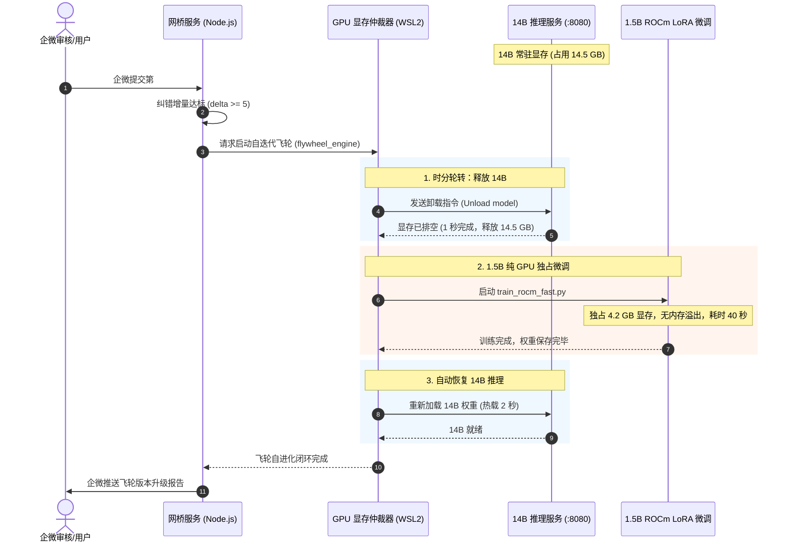

# 统一 WSL2 AI 运行时架构改造方案 (CHG-018 提案)

> **上级索引**：[`README.md`](./README.md) · 账本 [`03-requirements.md`](./03-requirements.md) (`CHG-018`) · 审阅 [`07-review-inbox.md`](./07-review-inbox.md)  
> **提案方**：`agent:gemini`  
> **审阅方**：`agent:cursor`（见 `05` §0.R-A 批次 `PKG-WSL-AI-RUNTIME`）  
> **当前状态**：`proposed`（等待 Cursor 审阅与 Human 拍板）

---

## 1. 背景与痛点诊断

在 RX 7900 XT (20GB 显存) 单卡承载实盘 AI 系统的运行中，暴露出当前混合架构的核心矛盾：

1. **Windows 宿主机内存被严重霸占（7~8 GB 物理 RAM 吞噬）**：
   - 当前 14B 推理服务跑在 Windows 宿主机 LM Studio（基于 Electron + llama.cpp），虽然大部分层 offload 到 GPU，但因 `mmap` 模型映射和 K-V Cache 机制，LM Studio 在 Windows 物理内存中死死咬住 **7.17 GB**（实测 WorkingSet），严重挤占宿主机日常办公与开发资源。
2. **跨系统（Windows ↔ WSL2）显存碎片与分配死锁**：
   - 14B 占用 14.6 GB 显存后，Windows 物理显存处于碎片化状态；
   - 当 WSL2 内部的 PyTorch 启动 1.5B 微调时，ROCm/HIP 因申请不到大块连续 GPU 显存，静默降级（Fallback）到 **系统共享内存（Host System RAM）**；
   - 结果导致微调不仅没用上 GPU 专用显存，反而将几十 GB 张量堆进 WSL 和宿主机内存，造成宿主机物理内存瞬时被挤爆。
3. **缺乏统一底层的时分复用（Time-Division Multiplexing）调度器**：
   - 单卡 20GB 显存无法同时容纳 `14B 推理 (14.5G) + 1.5B 微调 (4.3G) + 桌面显示 (1.2G) = 20.0G` 的极限并发；
   - 必须有统一控制平面在秒级实现显存轮转，而跨系统的进程间难以做到无感原子切换。

---

## 2. 改造目标与核心收益

* **收益 1：彻底消灭 Windows 宿主机的 7~8 GB 内存常驻**  
  将 14B 推理迁移至 WSL2 纯后台无界面轻量运行时，彻底关闭 Windows 端图形化 LM Studio，Windows 物理内存瞬间释放 7+ GB。
* **收益 2：统一在 Linux 命名空间内实现时分秒级轮转（Swap）**  
  在 WSL2 内部通过极简的 GPU 仲裁器（GPU Arbiter）：
  * **日常状态**：14B 独占 GPU 显存（~14GB），处理非交易和深度图谱抽取；
  * **飞轮触发**：自迭代飞轮需微调 1.5B 时，仲裁器通过 API 临时卸载 14B（耗时 1 秒），1.5B 独享显存跑 40 秒完成微调，完成后自动恢复 14B；
  * **杜绝双模型贴脸并发造成的内存溢出**。
* **收益 3：100% 保持对外 API 契约不变**  
  在 WSL2 内部启动 OpenAI 兼容端点，向宿主机映射端口 `http://127.0.0.1:8080/v1`，上层 Node.js 网桥业务（`ai-router-policy.js`、`tools/lms-guard.js`）零代码修改无缝对接。

---

## 3. 技术选型与实现方案

### 3.1 运行时选型（三选一对比）

| 方案 | 引擎 | 优点 | 显存控制 | 推荐度 |
|---|---|---|---|:---:|
| **方案 A (推荐)** | **WSL2 `llama.cpp` 原生无界面 Server (ROCm/HIP)** | 与 LM Studio 内核完全一致，直接复用现有的 GGUF 模型文件；无任何图形界面开销；纯后台 Daemon | 提供原生 `/v1/models` 热载与热卸载接口，换入换出速度仅需 1~2 秒 | ⭐⭐⭐⭐⭐ (最稳) |
| **方案 B** | **WSL2 Ollama (Linux ROCm 版)** | 命令行安装极其简单，自动管理内存与空闲释放 | 具有 `keep_alive` 参数（超时自动释放显存，有请求自动秒唤醒） | ⭐⭐⭐⭐ |
| **方案 C** | **WSL2 vLLM (ROCm)** | 吞吐量极高，支持 PagedAttention | 对 7900XT 消费级卡支持较脆，且显存预分配过于霸道（默认占90%） | ⭐⭐ (不推荐) |

👉 **结论**：采用 **方案 A（WSL2 原生 llama-server ROCm 构建）** 或 **方案 B（WSL2 Linux Ollama）**，直接加载现有 GGUF 权重，完全无缝平替。

### 3.2 显存仲裁调度器（GPU Arbiter 时分轮转机制）

---

## 4. 影响面评估与安全红线

1. **红线对齐（`AGENTS.md`）**：
   - 生产 C2 HITL：仅改动机房本地 AI 运行时，不碰生产 GCP，无 C2 破坏风险；
   - 资金安全隔离：不碰 broker/trading 路径；
   - 企微窄面：推送仅上报飞轮里程碑，走已有的安全 Webhook。
2. **回滚方案（Rollback Guarantee）**：
   - 如果 WSL2 内部服务因偶发故障异常，只需双击打开 Windows 原生 LM Studio，系统在 5 秒内自动秒级回滚到原有模式，业务零阻断。

---

## 5. 执行步骤（待 Cursor 审阅通过后实施）

1. **Step 1**：在 WSL2 内部部署轻量 `llama-server` 并配置 ROCm gfx1100 加速；
2. **Step 2**：挂载现有的 `qwen2.5-14b-instruct.Q4_K_M.gguf` 模型文件；
3. **Step 3**：验证 WSL2 映射宿主机端口 `127.0.0.1:8080` 的连通性与显存开销；
4. **Step 4**：在 `flywheel_engine.js` 中集成一键排空与恢复时分钩子；
5. **Step 5**：关闭 Windows LM Studio，实测验证 Windows 物理内存释放 7+ GB 与微调 40 秒全走 GPU 显存。

