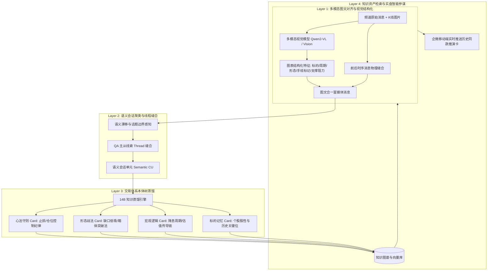

# 大V全频道多模态图文对齐与交易知识本体图谱方案 (REQ-037 专题规划)

> **上级索引**：[`README.md`](./README.md) · 账本 [`03-requirements.md`](./03-requirements.md)  
> **文档定位**：全频道非交易与策略知识深度沉淀的权威架构方案（待打磨评审 · `proposed`）。  
> **核心使命**：彻底跳出“机械固定时间开窗”与“纯文本 OCR”的局限，将大V（赵哥）86,000+ 条历史发言、K线图表手绘、群友提问解答，升维为**具备图文因果推演能力的交易体系多模态知识图谱**。

---

## 1. 现状痛点诊断：为什么“单纯开窗切片”效果不佳？

当前系统或常规 LLM 知识库处理大V长文本时，通常采用**「固定时间窗口（如每30分钟或固定10条滑动开窗）」+「纯文本正则/OCR」**，在实盘复盘中存在三大致命缺陷：

1. **因果时空链条被机械切断**：
   - 赵哥的完整教学通常跨越数分钟甚至数小时：
     - *10:05* [发图：K线突破图]
     - *10:07* “看这个30分钟级别的喇叭口，回补7200缺口前不加大仓”
     - *10:12* 群友：“赵哥，那止损位怎么定？”
     - *10:14* “弱势反弹跌破周五低点无条件降仓，底仓不盲动”
   - 若按固定窗口机械切分，提问、回答与图表被生硬割裂到不同 Chunk 中，知识失去上下文，导致检索时“答非所问”。
2. **图片语义成为孤岛（纯 OCR 丢失核心信息）**：
   - 传统 OCR 只能提取图中的日期、价格数字，完全丢失了赵哥手绘红圈标记的**关键均线、趋势线、突破箱体、筹码集中区**等真正的“盘感精髓”。
3. **噪音与干货混合，缺乏交易本体分类（Ontology）**：
   - 8.6 万条发言中，超过 70% 包含日常问候、大盘波动情绪宣泄、个股调侃。若未经策略体系结构化分类，知识库充斥噪音，召回准确率大幅退化。

---

## 2. 总体架构蓝图（四层多模态图谱架构）



---

## 3. 核心机制设计

### 3.1 图文深度缝合（Visual Anchor）
- **绝不把图片当作独立附件**，而是将其提升为**语义锚点**。
- 提取要素化 Schema：
  ```json
  {
    "chart_type": "K_LINE",
    "ticker": "TSLA",
    "timeframe": "30M",
    "patterns": ["日线下跌通道", "喇叭口收敛", "回补缺口"],
    "support_resistance": { "support": 422.0, "resistance": 445.0 },
    "hand_drawn_annotation": "手绘红圈圈出 422 均线企稳位置，箭头指向反弹"
  }
  ```
- **富媒体文本物理重塑**：将视觉要素以元数据前缀融入原文字中，让后续纯文本或理解模型天然拥有视觉记忆。

### 3.2 动态语义会话单元（Semantic CU）
- **抛弃固定时钟窗口**，采用**语义变点算法（Semantic Shift Detection）**：
  - 监控上下文发言的向量余弦距离；
  - 当大V从“宏观大盘讨论”切换到“特定个股操作（如 CIFR）”时，划定话题切分点。
- **Thread 提问-应答自动归属**：
  - 识别群聊中群友提问与赵哥回答的指代关系，将分散在多条发言中的互动聚合成高价值的“疑难解答知识对”。

### 3.3 交易本体树（Trading Ontology）
将提炼出的知识归类沉淀为四大标准卡片：
1. **心法守则 Card（Risk Control Rules）**：
   - 触发条件：*弱势反弹中跌破前一日最低点*
   - 执行动作：*无条件止损当天日内，降仓位至 3-4 成试错*
   - 理论底层：*防范单边暴跌踩踏重演*
2. **形态战法 Card（Technical Patterns）**：
   - 缺口回补战法、突破回踩战法、做T套利买2卖1降本法。
3. **宏观逻辑 Card（Macro Dynamics）**：
   - 美联储加降息预期与科技股高估值压制、A股港股联动传导链。
4. **标的记忆 Card（Asset Profile）**：
   - 单一标的的历史关键点位、机构控盘风格、股性记忆。

---

## 4. 与现有系统的架构协同

| 模块 | 角色与分工 | 现有硬件承载 |
|---|---|---|
| **端侧小模型 (1.5B/2.5B)** | **毫秒级武官**：负责盘中交易喊单抽取、秒级跟单决策 | 本地 LM Studio (显存 ~1.5GB, 耗时 400ms) |
| **本地大模型 (14B)** | **离线文官**：负责全频道语义 CU 聚类、知识本体抽取与卡片化 | 本地 LM Studio (显存 ~14.6GB, 深度推理) |
| **多模态视觉模型** | **视觉眼睛**：批量抽取历史 K 线截图的图表要素 | 本地 Qwen2-VL 或云端多模态接口 |
| **SQLite 知识库** | **知识载体**：存储结构化策略卡片与关系网络 | `whop_archive.db` 原生集成 |

---

## 5. 实施路线图（分期规划）

- **Phase 1（图文元数据打通）** ✅ MVP：
  - 表：`message_vision_meta`（`database.js`）
  - Stub 抽取：`tools/knowledge/vision-meta-stub.js`（不调 VL；`provider=stub` / `status=pending_vl`）
  - 小样本扫描：`npm run knowledge:vision-sample`（`tools/knowledge/phase1_vision_meta_sample.js`）
  - 单测：`test/test_vision_meta_req037_phase1.js`
  - **未做**：真实本地/云端 VL（等 Q-006）
- **Phase 2（语义会话聚类算法）**：实现基于话题漂移的 Dynamic CU 分割引擎，替换固定切片。
- **Phase 3（策略本体卡片自动化抽取）**：利用本地 14B 模型批量跑通 8.6 万条历史消息的四大卡片沉淀。
- **Phase 4（企微智能参谋卡盘中联动）**：冻结至业务通道 CHG + `wecom-freeze` 更新。

---

## 6. 评审与待办标记

- 账本对应：[`03-requirements.md`](./03-requirements.md) **`REQ-037` = `accepted`（分期门禁）**。  
- 评审结论：[`07-review-inbox.md`](./07-review-inbox.md) · 2026-09-15 · `agent:cursor`。  
- **可实施**：仅 Phase 1 MVP（小样本视觉元数据 + 落表）；Phase 2–3 须补表结构/验收指标后再开。  
- **冻结**：Phase 4 企微推送在业务通道 CHG + `wecom-freeze` 更新前不得开工（`REJ-008`）。  
- Human 开放题：[`04`](./04-leftovers-problems.md) **Q-006**（本地 VL vs 云端）。
